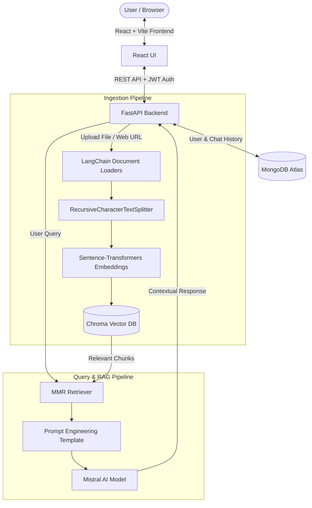

# 🚀 Chatify.AI — Multi-Source RAG & Document Intelligence Platform


**Chatify.AI** is a production-grade Retrieval-Augmented Generation (RAG) and document assistant platform. It enables context-aware, instant Q&A over private documents (`PDF`, `DOCX`, `TXT`, `CSV`) and live Web Page URLs using **LangChain**, **Sentence-Transformers**, **ChromaDB**, and **Mistral AI**.

---

## ✨ Key Features

- **🌐 Multi-Source Data Ingestion**:
  - **Documents**: Upload `.pdf`, `.docx`, `.doc`, `.txt`, `.csv` files.
  - **Web Page URLs**: Ingest any live public website or article URL via `WebBaseLoader`.
- **⚡ Advanced RAG Pipeline**:
  - **Chunking**: `RecursiveCharacterTextSplitter` (1000 characters chunk size, 200 overlap).
  - **Embeddings**: Open-source `sentence-transformers/all-MiniLM-L6-v2`.
  - **Vector Store**: Persistent **Chroma DB** store.
  - **Search Strategy**: **MMR (Maximal Marginal Relevance)** search to minimize redundancy and maximize context diversity (`k=4`, `fetch_k=10`).
  - **LLM**: **Mistral AI** (`mistral-small-latest`) with custom anti-hallucination prompt engineering.
- **🎨 Modern React UI**:
  - Tabbed Modal for seamless File Uploads & Web URL Ingestion.
  - Rich **Markdown Rendering** (`react-markdown`) for clear AI responses.
  - Dark / Light Mode with Tailwind CSS.
- **🔒 Authentication & Chat History**:
  - JWT Bearer Token Authentication + Password Hashing (Bcrypt).
  - Asynchronous chat session persistence in **MongoDB Atlas** (using `Motor`).

---

## 🏗️ System Architecture



---

## 🛠️ Tech Stack

| Domain | Technology | Description |
| :--- | :--- | :--- |
| **Backend** | Python 3.11+, FastAPI, Uvicorn | High-performance async REST APIs |
| **GenAI & RAG** | LangChain, HuggingFace, Mistral AI | LLM orchestration and retrieval pipeline |
| **Vector DB** | ChromaDB | Persistent local vector store with MMR retrieval |
| **Database** | MongoDB Atlas, Motor | Async MongoDB client for users & history |
| **Frontend** | React 18, Vite, Tailwind CSS | Responsive, modern web interface |
| **UI Tools** | Lucide Icons, React Markdown | Micro-animations and rich text formatting |
| **Auth** | OAuth2, Passlib (Bcrypt), Python-Jose | Secure JWT authentication flow |

---

## 📁 Repository Structure

```text
ChatWithData/
├── backend/
│   ├── main.py              # FastAPI server, CORS, Auth & RAG endpoints
│   ├── rag_service.py       # RagService class (Document Loaders, Vector DB, LLM)
│   ├── auth.py              # Password hashing & JWT token handling
│   ├── database.py          # MongoDB Async client connection
│   ├── requirements.txt     # Backend Python dependencies
│   └── .env                 # Environment variables (API Keys, MongoDB URL)
├── frontend/
│   ├── src/
│   │   ├── components/      # React components (ChatInterface, UploadModal, etc.)
│   │   ├── layouts/         # Dashboard layout & Sidebar
│   │   ├── lib/             # Axios API base configuration
│   │   ├── App.jsx          # App routing & Auth Protected Routes
│   │   └── main.jsx         # React DOM entry point
│   ├── package.json         # Frontend dependencies
│   └── tailwind.config.js   # Tailwind styling setup
└── docker-compose.yml       # Multi-container orchestration (Optional)
```

---

## ⚡ Quick Start Guide

### 1. Prerequisites
- **Python** 3.10 or higher
- **Node.js** v18 or higher
- **MongoDB Atlas** connection string or local MongoDB instance
- **Mistral AI API Key** ([Get your key here](https://console.mistral.ai/))

---

### 2. Backend Setup

```bash
# Navigate to backend directory
cd backend

# Create & activate a virtual environment
python -m venv .venv
# On Windows:
.venv\Scripts\activate
# On Linux/macOS:
source .venv/bin/activate

# Install dependencies
pip install -r requirements.txt

# Create .env file inside backend/ directory:
# MISTRAL_API_KEY=your_mistral_api_key
# MONGODB_URL=your_mongodb_connection_string
# SECRET_KEY=your_jwt_secret_key

# Run FastAPI Server
uvicorn main:app --reload
```
Server running at: `http://127.0.0.1:8000`  
Swagger API Docs available at: `http://127.0.0.1:8000/docs`

---

### 3. Frontend Setup

```bash
# Open a new terminal and navigate to frontend directory
cd frontend

# Install packages
npm install

# Start Vite Development Server
npm run dev
```
Frontend running at: `http://localhost:5173`

---

## 🔌 API Endpoint Reference

| Method | Endpoint | Description | Auth Required |
| :--- | :--- | :--- | :--- |
| `POST` | `/signup` | Create a new user account | ❌ No |
| `POST` | `/token` | Login and receive JWT access token | ❌ No |
| `POST` | `/upload` | Ingest PDF, DOCX, TXT, or CSV document | ✅ Yes |
| `POST` | `/upload-url` | Ingest a live public Web Page URL | ✅ Yes |
| `POST` | `/chat` | Query the RAG system and update chat history | ✅ Yes |
| `GET` | `/history` | Fetch user's chat sessions history | ✅ Yes |
| `GET` | `/history/{chat_id}` | Fetch specific chat session messages | ✅ Yes |
| `DELETE` | `/history/{chat_id}` | Delete a chat session | ✅ Yes |

---

## 🐳 Docker Setup (Optional)

You can also run the entire stack using Docker Compose:

```bash
# Build and run containers
docker-compose up --build -d
```

---

## 🛡️ License

Distributed under the MIT License. See `LICENSE` for more information.

---

## 👤 Author

**Pranav Sarvaiyya**  
- **GitHub**: [@PranavSarvaiyya](https://github.com/PranavSarvaiyya)  
- **Project Link**: [Chatify.AI](https://github.com/PranavSarvaiyya/Chatify.AI)
